# App Name

## Table of Contents

- [Description](#description)
- **For End Users**
  - [Where to View on the Web](#where-to-view-on-the-web)
  - [Usage and Screenshots](#usage-and-screenshots)
- **For Developers**
  - [Future Improvements](#future-improvements)
  - [Installation Instructions](#installation-instructions)
  - [Technologies Used](#technologies-used)
  - [Dependencies and Credits](#dependencies-and-credits)
  - [Project Structure](#project-structure)

## Description

This is a simple scheduling website. It uses the GeoApify API for locations and timezones and assists users in scheduling meetings with people in different timezones.

### Features

- Select a meeting date
- View time slots compared between timezones
- Output a meeting to various calendars
  - Currently supported:
    - Apple calendar
    - Google calendar
    - Office365
    - Outlook (web)
    - Yahoo calendar
    - Any other calendar that can use an ICS file

## Where to View on The Web

<a style="align-items: center; display: flex; font-size: 1.5rem; gap: 1rem" href="https://harmony.groundedwanderer.dev/">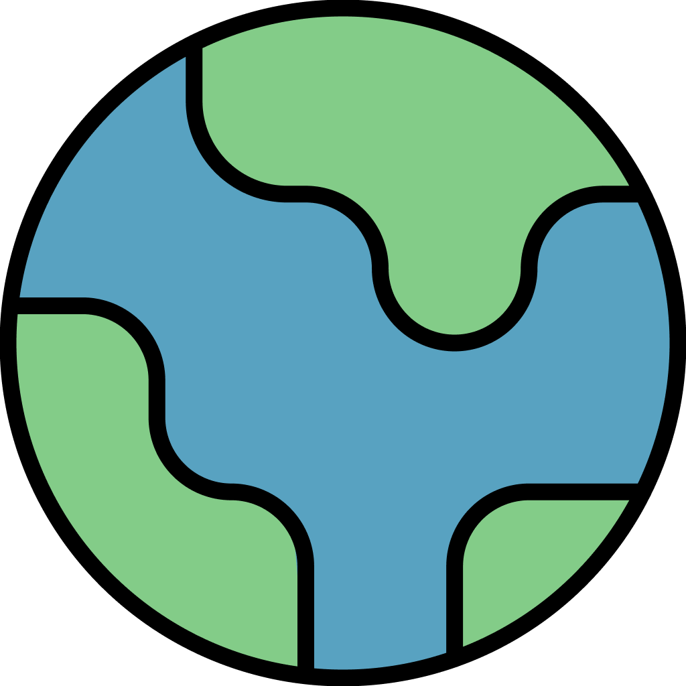Try it out online!</a>

## Usage and Screenshots

<div>
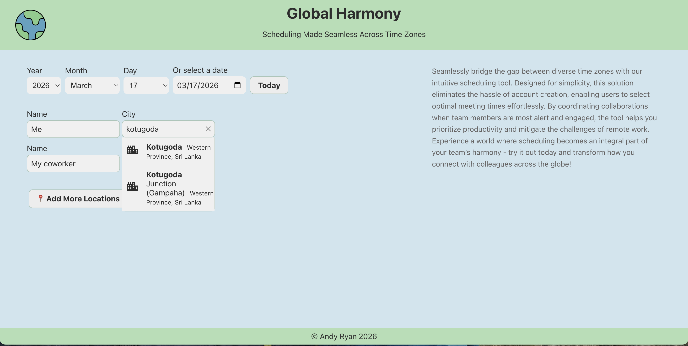
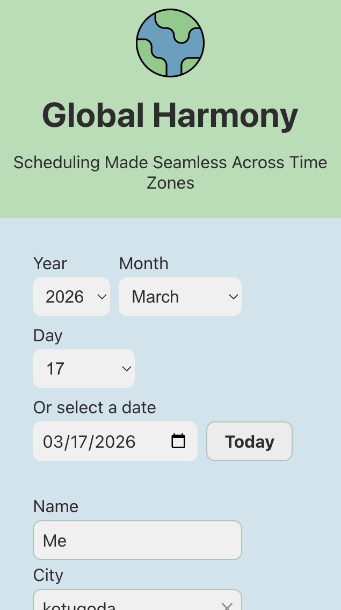
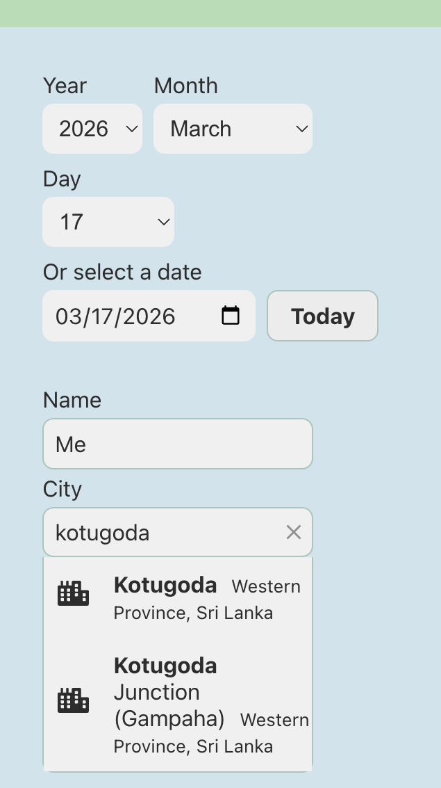
</div>

After getting to the web page you first enter the names of the people. To add more people, click the **📍 Add More Locations** button.

<div>
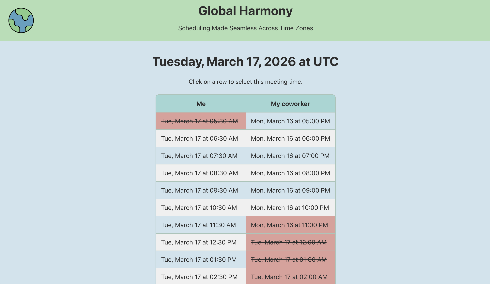
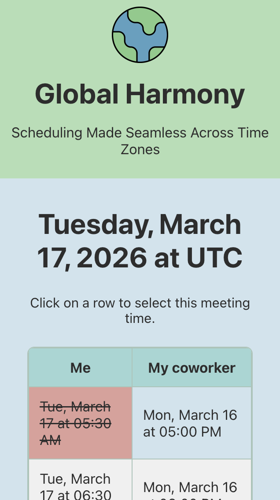
</div>

The next step is to select a time slot. This is just to get a rough idea; you can pick a more exact meeting time at the next step. Times that are not good have a red background and ~~strikethrough~~ text.

<div>
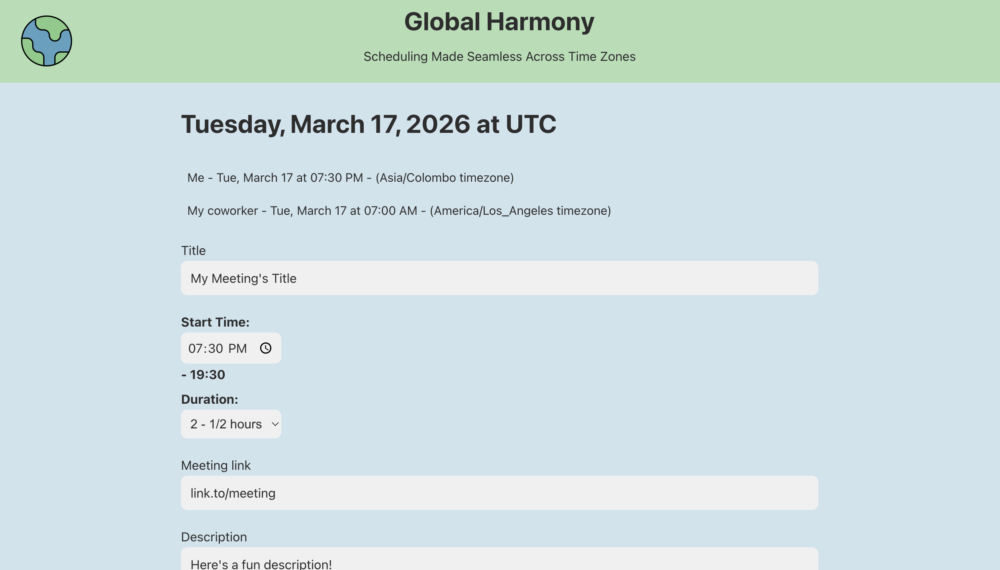
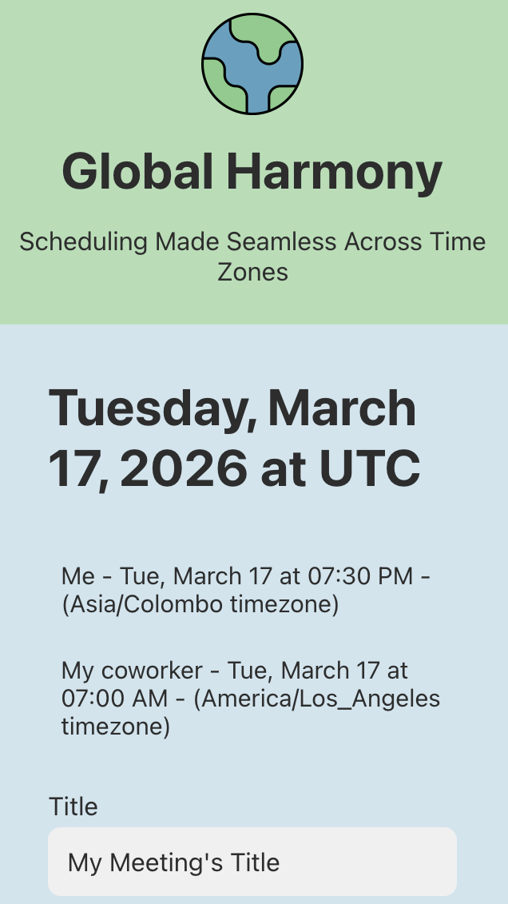
</div>

Now just fill in your meeting details.

<div>
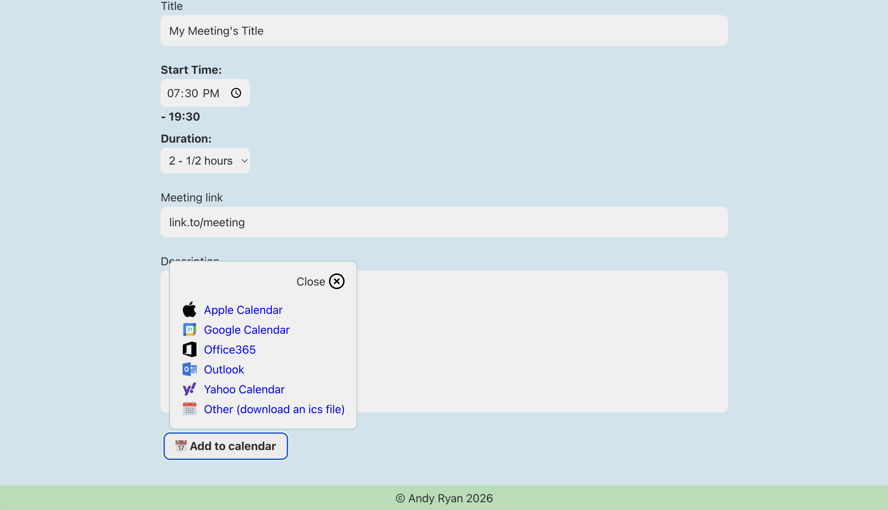
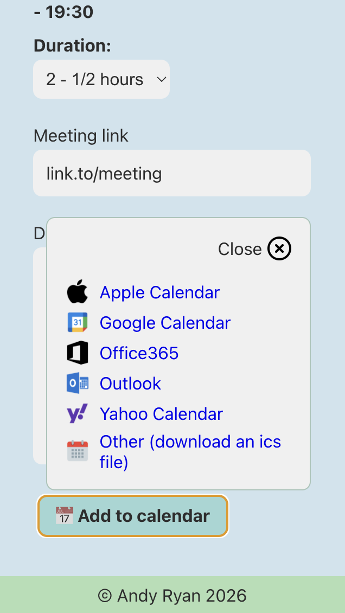
</div>

After filling in your meeting details, pick the calendar type that you want to add your meeting to. If your calendar isn't listed (for example, **Proton**), select the **Other (download an ics file)** option.

<div>
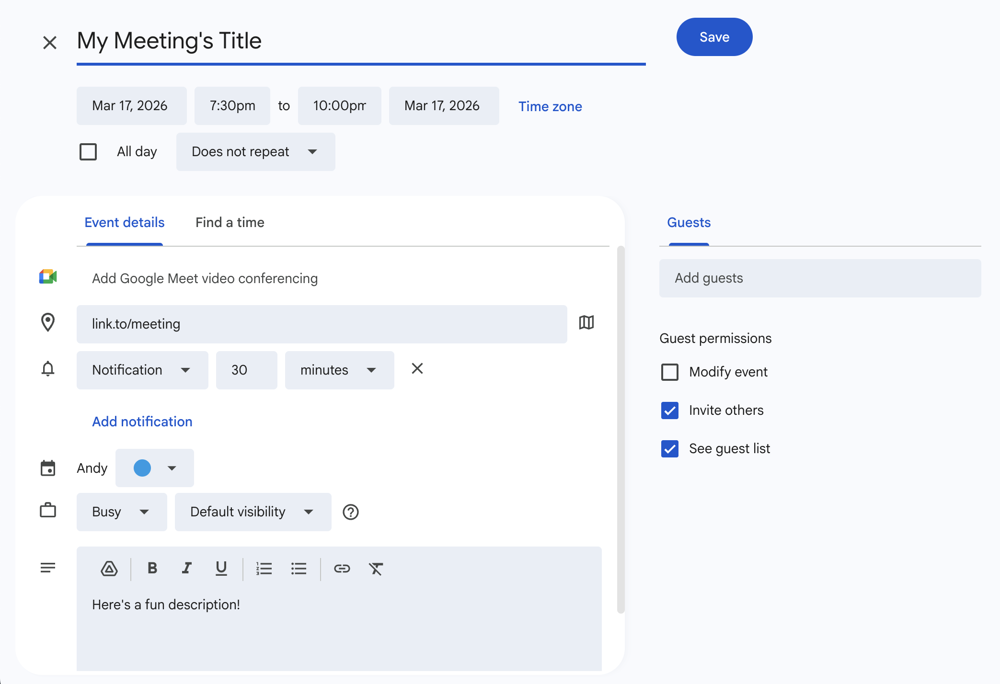
</div>

Here is what our meeting looks like in Google calendar. Keep in mind that the time shown will be for your local timezone; it will update to other people's correct timezone when they view it.

## Future Improvements

- Let users set and share their available hours via a URL
- Add local storage to save users location
- Add method to get users current location so they don't have to fill it in

## Installation Instructions

1. If you haven't already, [install Node.js and npm](https://www.theodinproject.com/lessons/foundations-installing-node-js)
   - Note that installing Node.js [also installs npm](https://www.theodinproject.com/lessons/foundations-installing-node-js#step-2-setting-the-node-version)
1. Fork this repo
1. In your copy of the repo click the green **Code** button and copy the URL
1. Open your IDE
1. `cd PARENT_DIRECTORY_FOR_THIS_PROJECT`
1. `git clone COPIED_URL`
1. `cd PROJECT_FOLDER`
1. Run the following in your terminal
   ```bash
   npm init -y
   npm install
   ```
1. ```bash
   npm run dev
   ```

   - `^` + `c` will end the process

1. Navigate to the url displayed in the terminal: `➜  Local:   http://localhost:5173/`

## Technologies Used

- <a href="https://developer.mozilla.org/en-US/docs/Web/CSS"> CSS</a>
- <a href="https://eslint.org/"> ESLint</a>
- <a href="https://developer.mozilla.org/en-US/docs/Web/HTML"> HTML</a>
- <a href="https://developer.mozilla.org/en-US/docs/Web/JavaScript"> JavaScript</a>
- <a href="https://react.dev/"> React</a>
- <a href="https://www.typescriptlang.org/"> TypeScript</a>
- <a href="https://vite.dev/"> Vite </a>

### Development Tools

- <a href="https://code.visualstudio.com/"> VS Code</a>
- <a href="https://www.npmjs.com/"> npm</a>
- <a href="https://git-scm.com/"> Git</a>

### Hosting

- <a href="https://www.cloudflare.com/"> Cloudflare</a>
- <a href="https://github.com/"> Github</a>

## Dependencies and Credits

### Package Dependencies

- [@eslint/js](https://www.npmjs.com/package/@eslint/js)
- [@geoapify/geocoder-autocomplete](https://www.npmjs.com/package/@geoapify/geocoder-autocomplete)
- [@geoapify/react-geocoder-autocomplete](https://www.npmjs.com/package/@geoapify/react-geocoder-autocomplete)
- [@types/node](https://www.npmjs.com/package/@types/node)
- [@types/react](https://www.npmjs.com/package/@types/react)
- [@types/react-dom](https://www.npmjs.com/package/@types/react-dom)
- [@typescript-eslint/eslint-plugin](https://www.npmjs.com/package/@typescript-eslint/eslint-plugin)
- [@typescript-eslint/parser](https://www.npmjs.com/package/@typescript-eslint/parser)
- [@vitejs/plugin-react](https://www.npmjs.com/package/@vitejs/plugin-react)
- [calendar-link](https://www.npmjs.com/package/calendar-link)
- [eslint](https://www.npmjs.com/package/eslint)
- [eslint-config-prettier](https://www.npmjs.com/package/eslint-config-prettier)
- [eslint-plugin-react-hooks](https://www.npmjs.com/package/eslint-plugin-react-hooks)
- [eslint-plugin-react-refresh](https://www.npmjs.com/package/eslint-plugin-react-refresh)
- [globals](https://www.npmjs.com/package/globals)
- [react](https://www.npmjs.com/package/react)
- [react-dom](https://www.npmjs.com/package/react-dom)
- [react-router-dom](https://www.npmjs.com/package/react-router-dom)
- [typescript](https://www.npmjs.com/package/typescript)
- [typescript-eslint](https://www.npmjs.com/package/typescript-eslint)
- [uuid](https://www.npmjs.com/package/uuid)
- [vite](https://www.npmjs.com/package/vite)

### Other Credits

- Logo is based on the **globe outline** icon from the [Heroicons Figma plugin](https://github.com/deebov/heroicons-figma-plugin)
- Email icons are from [Icons8](https://icons8.com/icons)
- [GeoApify](https://www.geoapify.com/) API and React component
- [Devicion](https://devicon.dev/)
- [Skillicons](https://skillicons.dev/)

## Project Structure

```bash
src/
├── components/                 # Reusable UI components
│   ├── AddToCalendarButton.tsx # Button to add event to calendar
│   ├── Footer.tsx              # Page footer component
│   ├── Header.tsx              # Page header component
│   └── LocationInput.tsx        # Geoapify geocoder input component
├── pages/                      # Page components (routed)
│   ├── LocationSelector.tsx    # Step 1: Select locations and attendees
│   ├── MeetingCreator.tsx      # Step 3: Create/edit meeting details
│   └── ScheduleViewer.tsx      # Step 2: View schedule in GMT and local times
├── styles/                     # Stylesheet organization
│   ├── AddToCalendarButton.css
│   ├── App.css
│   ├── Footer.css
│   ├── Header.css
│   ├── index.css               # Global styles
│   ├── LocationSelector.css
│   ├── MeetingCreator.css
│   ├── ScheduleViewer.css
│   └── theme.css               # Theme variables and utilities
├── App.tsx                     # Main app component with routing
├── main.tsx                    # React entry point
├── types.ts                    # TypeScript interfaces and types
├── utils.ts                    # Utility functions for timezone handling
└── assets/                     # Static assets
```
